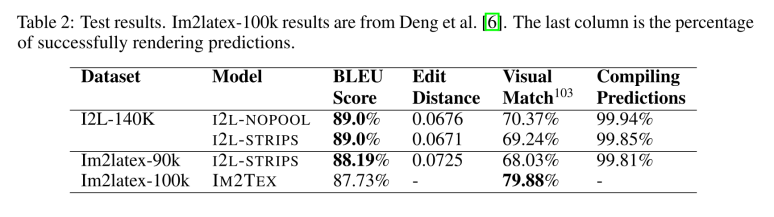
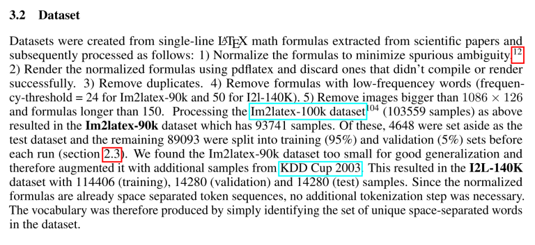
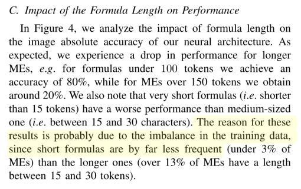

# The `im2latex` problem

## OpenAI request for research

# Proposed Model

* Neural Network

* Recurrent Neural Network (RNN)

* Long-Short-Term-Memory (LSTM)

* attention mechanism

# `im2latex` Deng et al. 2017 

* introduced `im2latex-100k` dataset

* matched formulae using regular expressions, only

* normalized formulae

* BiLingual Evaluation Understudy (BLEU) of 87.73

# Other Solutions to `im2latex`

| Researchers  | BLEU Score (%) | Training Time |
|--------------|------------|---------------|
| Deng et al 2017 | 87.73 | 20 hours |
| Genthial 2017 | 88.00 | - |
| Wang, Sun & Wang 2018 | 88.25 |  - |
| Singh 2018 | 89.00 | 60 hours |
| Wang & Liu 2019 | 90.28 | 75 hours|

# Singh's `im2latex`

# Comments

# Wang & Liu's `im2latex`

# Our Data

## We have

* [Harvested 1 month of publications Jan 2018](http://archive.org/)

* Extracted All TeX files

* Expanded macros in 7200 files

* Extracted 15,220 \LaTeX{} files

## We want

* higher matching rate

* class balance

* token length balance

# Singh's `im2latex`  Model

## Upgrading

* [Ported model to Python 3](https://github.com/untrix/im2latex)

* Future plans to upgrade Tensorflow to v2

* Deal with deprecated dependencies 

# Progress so far 

## Training model

* Model has been deployed on a Google-Cloud GPU learner and locally for consistency
* Trains without problems - all log files show promising results
* Currently has problems restoring from checkpoint

## Following Upgrades to Model

* Be able to tweak the attention model and customizable hyperparameters of the model
* Upgrade preproccessing scripts to work on Blake's generated data for consistency
* Experiment with running the  model on various data categories (i.e Matrices, Equations, Piece-wise Functions)

# Timeline

* Finalize Porting (3 days)

* Initial Assessments (4 days)

* Final Runs 
