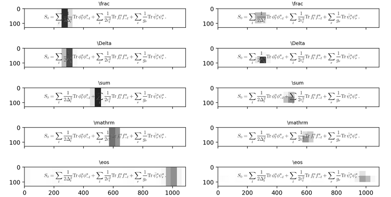

\newcommand{\BLEU}{\textsc{Bleu}}

# The `im2latex` problem

* Math Image to Math Code



# Accomplishments

* Synthesized Dataset from Scratch

* 500,000 text examples! 

* 170,000 original example images

  * Deng used 100k and Singh 140k

* 2 Models Trained and Ready for Inference!

# State of the art in `im2latex`

| Researchers  | BLEU Score (%) | Training Time |
|--------------|------------|---------------|
| Deng et al 2017 | 87.73 | 20 hours |
| Genthial 2017 | 88.00 | - |
| Wang, Sun & Wang 2018 | 88.25 |  - |
| Singh 2018 | 89.00 | 60 hours |
| **Taradachuk & Vente** | 88.48 | 75 hours |
| Wang & Liu 2019 | 90.28 | 75 hours|

# Our Data Processing Pipeline


# Interpreting BLEU Score

* Let $p_i$ be geometric mean of $n$-gram precisions

## Brevity Pentalty

\begin{equation}
 \text{BP} = \begin{cases}1 &\text{ if } c>r \\
  e^{1-r/c} &\text{ otherwise }\end{cases}.
\end{equation}

## Calculation

\begin{equation}
  \text{\BLEU} = \text{BP} \exp\left( \sum_{i=1}^n w_i \log p_i \right)
\end{equation}

\footnote{The following are simplified contrived examples, using 4-gram BLEU
score. For a more complete picture see Papineni, Roukos, Ward, et al.}

# Example 1

```python
reference = [
  ['the', 'quick', 'brown', 'fox',
  'jumped', 'over', 'the', 'lazy', 'dog']
]
candidate =
  ['the', 'quick', 'brown', 'fox',
  'jumped', 'over', 'the', 'lazy', 'dog']
print(sentence_bleu(reference, candidate))
```

* 1.0

# Example 2

```python
reference = [
  ['the', 'quick', 'brown', 'fox',
  'jumped', 'over', 'the', 'lazy', 'dog']
]
candidate =
  ['the', 'FAST', 'brown', 'fox',
  'jumped', 'over', 'the', 'lazy', 'dog']
print(sentence_bleu(reference, candidate))
```

* 1 wrong token at length 9

* 0.7506...

# Notes and Take-Aways

* real data will account for synonyms

* steep penalty for any bad tokens on short sequences

* to (really) simplify missing words and extra words "count as incorrect"

# Distribution of Input Length


# Distribution of Scores


# Distribution of Scores


# Distribution of Scores


# Distribution of Scores


# Demo Time

* Sample Images from the class!

# Special Thanks

* Brian Newbold (archivist)

* Sumeet S. Singh  (works at Turnitin (Gradescope) now )

# Improvement Points

* used command line for processing

  * allowed rapid iteration, *but*

  * should've been python scripts

* Tensorflow 2.0 differences made translation prohibitive

  * Kept to the last stable release on the 1.0 branch

# Questions?

* Ask Us about...

  * ANN structure,

  * Virtual Machine; or

  * The models better than ours.