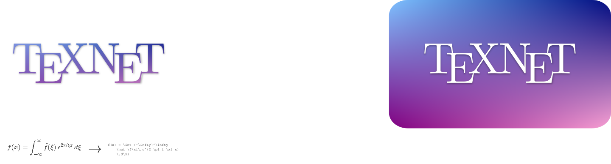
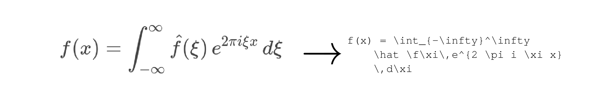

<p align="center">
  
</p>

<p align="center">
  
</p>

The prospect of accurately transcribing mathematical expression into a
markup representation is enticing because it opens the doors for
bringing new life to old mathematical texts or those for which the
source code is unavailable.

We make that dream a reality with this project, where we build on [Sumeet Singh's](https://github.com/untrix/im2latex) work porting the model to Python3 and bringing our own dataset of 170,000 examples.

Dynamic Content
-----------

[](https://www.youtube.com/watch?v=ew6JG2c3M24 "AI Translates Math Images into Code")

[Sumeet S. Singh's Project Site](https://github.com/untrix/im2latex)

Static Content
-----------

[Complete Dataset](https://drive.google.com/file/d/1mwUwoyhcz63mTd3s1v4Q8QoRBPBSzGEi/view?usp=sharing)

[Research Paper](https://github.com/rvente/TeXNet.ai/blob/master/Final-Paper/Final_Paper.pdf)

Team
----

<a href="https://github.com/rvente"></a>
<a href="https://github.com/taradactyl27"></a>

Directory Structure
==========

```
TEXNET
│   
│      
│
└───data -> has to be made by the user (extract data folder in there)
│   │   
│   │   
│   │
│   └───formula_images
│       │   *.png    
│   
└───src -> main directory of where model will be ran
│   │   
│   │   
│   │
│   └───tools
│   │   │   prepareData.py -> run first when images are placed in inference folder
│   │   │   predict.py -> run this script after running the model based on the script outputted from prepareData.py
│   │   │   predictions.csv -> outputted csv with filenames and LaTeX predictions
│   │   
│   │   
│   │
│   └───tb_metrics -> main logging directory where logs from model training will be stored
│   │
│   │
│   │  run.py -> main file that runs the model, has settable hyperparameters and variables that need to be specified based on the training machine
|
└───predictions
│   │   
│   │   
│   │
│   └───formula_images -> paste images to perform inference on here before running inference scripts

```

